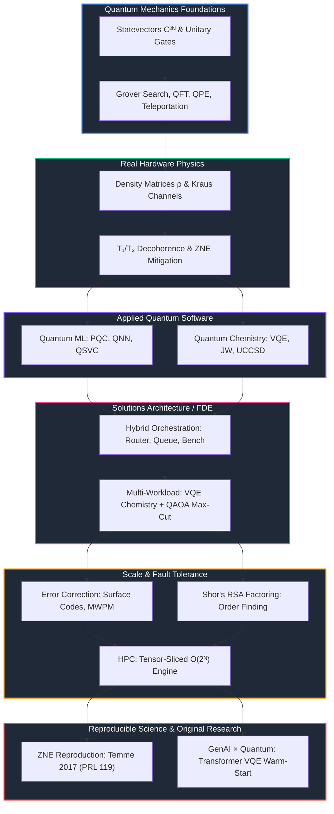

# ⚛️ Applied Quantum Computing, Research & HPC Simulation Portfolio

[](https://www.python.org/)
[](LICENSE)
[](#-repository-index)

Master portfolio consolidating **10 research-grade repositories** spanning quantum foundations, applied algorithms, Solutions Architecture, reproducible science, and original GenAI × Quantum research — all built from mathematical first principles with full test coverage.

---

## 🗺️ Master Repository Index

| Stage | Domain | Repository | Status | Key Contributions |
| :---: | :--- | :--- | :---: | :--- |
| **Research** | **GenAI × Quantum (Original)** | [`quantum-genai-warmstart`](https://github.com/aashiq-parinda/quantum-genai-warmstart) | ✅ `14/14 tests` | **Original research**: 12K-param pure-NumPy transformer predicting VQE warm-start parameters. **Zenodo Published (DOI: [10.5281/zenodo.21998273](https://doi.org/10.5281/zenodo.21998273))**. |
| **Research** | **ZNE Paper Reproduction** | [`quantum-zne-reproduction`](https://github.com/aashiq-parinda/quantum-zne-reproduction) | ✅ `21/21 tests` | **Temme et al. 2017 Reproduction**: Gate folding, Richardson extrapolation, Figs 1–3, discrepancy analysis. **Zenodo Published (DOI: [10.5281/zenodo.21979332](https://doi.org/10.5281/zenodo.21979332))**. |
| **FDE** | **Hybrid Orchestration** | [`quantum-hybrid-orchestration`](https://github.com/aashiq-parinda/quantum-hybrid-orchestration) | ✅ `9/9 tests` | **Solutions Architect / FDE Evidence**: Pre-processing → Quantum dispatch → Post-processing loop, smart backend router (Sim vs QPU), job queue, VQE & QAOA adaptability, Executive Translation Blog (99.78% cost reduction via hybrid loops). |
| **01** | **Quantum Foundations** | [`quantum-computing-foundations`](https://github.com/aashiq-parinda/quantum-computing-foundations) | ✅ `28/28 tests` | Statevector $\mathbb{C}^{2^N}$, Grover's search $O(\sqrt{N})$, QFT, QPE, Deutsch-Jozsa, Teleportation, Superdense Coding. |
| **02** | **Open Systems & Noise** | [`quantum-simulation-noise`](https://github.com/aashiq-parinda/quantum-simulation-noise) | ✅ `12/12 tests` | Density matrices $\rho$, Kraus channels $\sum K_i \rho K_i^\dagger$, $T_1/T_2$ relaxation, Zero Noise Extrapolation (ZNE). |
| **03** | **Quantum Machine Learning** | [`quantum-machine-learning`](https://github.com/aashiq-parinda/quantum-machine-learning) | ✅ `9/9 tests` | Parameter-Shift gradients $\frac{\partial E}{\partial \theta_i}$, QNN Classifiers, Quantum Kernels (QSVC), Barren Plateau diagnostics. |
| **04** | **Quantum Chemistry** | [`quantum-chemistry-sim`](https://github.com/aashiq-parinda/quantum-chemistry-sim) | ✅ `14/14 tests` | Second Quantization $a_i^\dagger, a_i$, Jordan-Wigner transform, Molecular $H_2$ & $LiH$ Hamiltonians, VQE & UCCSD. |
| **05** | **Quantum Error Correction** | [`quantum-error-correction`](https://github.com/aashiq-parinda/quantum-error-correction) | ✅ `20/20 tests` | Repetition, 9-qubit Shor, 7-qubit Steane CSS, Distance-$d$ Surface Code, MWPM decoder. |
| **06** | **Shor's Factoring Algorithm** | [`quantum-shor-factoring`](https://github.com/aashiq-parinda/quantum-shor-factoring) | ✅ `20/20 tests` | Modular exponentiation $x^a \bmod N$, QFT period finding, Continued fractions, RSA factoring ($N=15,21,35$). |
| **07** | **HPC & GPU Acceleration** | [`quantum-hpc-acceleration`](https://github.com/aashiq-parinda/quantum-hpc-acceleration) | ✅ `19/19 tests` | Tensor-sliced $O(2^N)$ statevector contraction, 30-qubit memory scaling, vectorized NumPy `einsum` batching. |

---

## 🧬 Full Research Progression Roadmap



---

## 🛠️ Open-Source Ecosystem Contributions & Case Studies

| Ecosystem | Focus | Issue / PR | Artifact & Analysis | Status |
| :--- | :--- | :--- | :--- | :---: |
| **Qiskit SDK** | **Arithmetic Circuit Library** | [Issue #16168](https://github.com/Qiskit/qiskit/issues/16168) / [PR #16394](https://github.com/Qiskit/qiskit/pull/16394) | [`MultiplierGate` Truncated Result Decomposition Case Study](../qiskit/CASE_STUDY_ISSUE_16168.md) | ✅ Merged Upstream |

---

## ⚡ Quickstart

```bash
# Paper Reproduction
git clone https://github.com/aashiq-parinda/quantum-zne-reproduction.git
cd quantum-zne-reproduction && python3 -m venv .venv && source .venv/bin/activate
pip install -e ".[dev]" && pytest tests/ -v && python example.py

# Original Research: GenAI × Quantum
git clone https://github.com/aashiq-parinda/quantum-genai-warmstart.git
cd quantum-genai-warmstart && python3 -m venv .venv && source .venv/bin/activate
pip install -e ".[dev]" && pytest tests/ -v && python example.py
```

---

## 📄 License

All repositories are open-source under the [MIT License](LICENSE).

