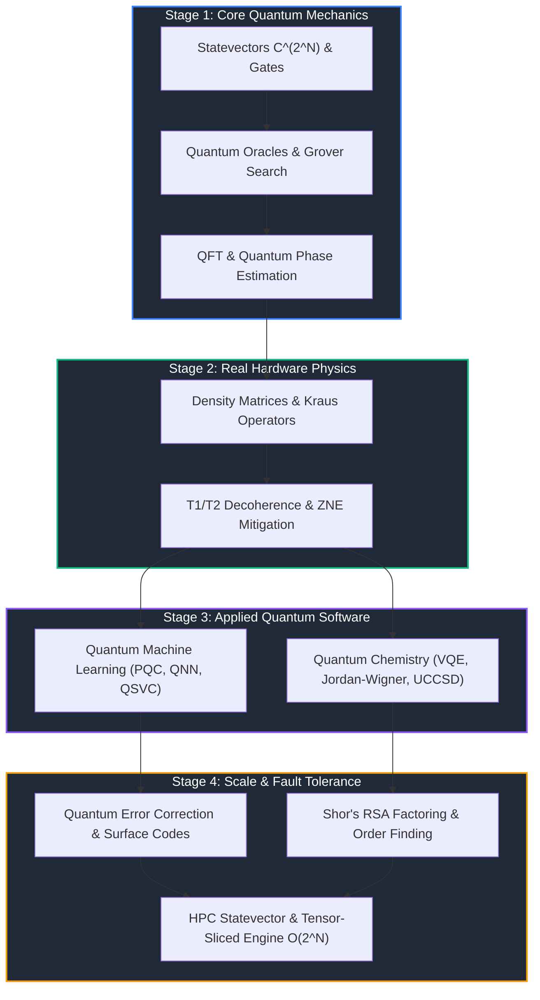

# ⚛️ Applied Quantum Computing & HPC Simulation Portfolio

[](https://www.python.org/)
[](LICENSE)
[](#-repository-index)

Welcome to the master portfolio repository consolidating 7 research-grade repositories built from mathematical first principles. This suite covers the full spectrum of modern quantum computing — from statevector gate propagators and open-system density matrix channels to Quantum Machine Learning, VQE Quantum Chemistry, Surface Code Error Correction, Shor's RSA Factoring Algorithm, and HPC GPU-accelerated tensor contraction engines.

---

## 🗺️ Master Repository Index

| Stage | Domain | Repository | Status | Key Features & Math |
| :---: | :--- | :--- | :---: | :--- |
| **01** | **Quantum Foundations** | [`quantum-computing-foundations`](https://github.com/FLYINGSKATE/quantum-computing-foundations) | ✅ `28/28 tests` | Statevector $\mathbb{C}^{2^N}$, unitary gates, Grover's search $O(\sqrt{N})$, QFT, QPE, Deutsch-Jozsa, Teleportation. |
| **02** | **Open Systems & Noise** | [`quantum-simulation-noise`](https://github.com/FLYINGSKATE/quantum-simulation-noise) | ✅ `12/12 tests` | Density matrices $\rho$, Kraus channels $\sum K_i \rho K_i^\dagger$, $T_1/T_2$ relaxation, Zero Noise Extrapolation (ZNE). |
| **03** | **Quantum Machine Learning** | [`quantum-machine-learning`](https://github.com/FLYINGSKATE/quantum-machine-learning) | ✅ `9/9 tests` | Parameterized Quantum Circuits (PQC), exact Parameter-Shift gradients $\frac{\partial E}{\partial \theta_i}$, QNN, QSVC, Barren Plateaus. |
| **04** | **Quantum Chemistry** | [`quantum-chemistry-sim`](https://github.com/FLYINGSKATE/quantum-chemistry-sim) | ✅ `14/14 tests` | Second Quantization $a_i^\dagger, a_i$, Jordan-Wigner transform, molecular $H_2$ & $LiH$ Hamiltonians, VQE & UCCSD. |
| **05** | **Quantum Error Correction** | [`quantum-error-correction`](https://github.com/FLYINGSKATE/quantum-error-correction) | ✅ `20/20 tests` | Repetition code, 9-qubit Shor code, 7-qubit Steane CSS code, Distance-$d$ Surface Code, MWPM decoder. |
| **06** | **Shor's Factoring Algorithm** | [`quantum-shor-factoring`](https://github.com/FLYINGSKATE/quantum-shor-factoring) | ✅ `20/20 tests` | Modular exponentiation $x^a \bmod N$, QFT period finding, continued fractions rational approximation, RSA factoring. |
| **07** | **HPC & GPU Acceleration** | [`quantum-hpc-acceleration`](https://github.com/FLYINGSKATE/quantum-hpc-acceleration) | ✅ `19/19 tests` | Tensor-sliced $O(2^N)$ statevector contraction, memory profiling up to 30 qubits, vectorized NumPy `einsum` batching. |

---

## 🧬 Curriculum & Architecture Roadmap



---

## 📊 Comprehensive Algorithmic Purpose Matrix (42 Algorithms)

| Category | Algorithm / Feature | Real-World Application & Benefit |
| :--- | :--- | :--- |
| **Foundations** | **Grover's Search** | Quadratic speedup $O(\sqrt{N})$ for database search & SAT solving. |
| **Foundations** | **Quantum Phase Estimation (QPE)** | Subroutine for Shor's algorithm, energy estimation, & eigenvalue computation. |
| **Foundations** | **Quantum Teleportation** | Secure quantum communication & distributed quantum computing nodes. |
| **Noise & Mitigation** | **Zero Noise Extrapolation (ZNE)** | Error mitigation on noisy NISQ hardware without additional physical qubits. |
| **Noise & Mitigation** | **Readout Error Mitigation** | Inverts measurement confusion matrices to restore true probability counts. |
| **Quantum ML** | **Parameter-Shift Rule** | Computes exact analytical gradients on real quantum hardware without backprop. |
| **Quantum ML** | **Quantum Support Vector Classifier (QSVC)** | Non-linear classification by mapping data into $2^N$-dimensional Hilbert space. |
| **Quantum Chemistry** | **Jordan-Wigner Transformation** | Maps fermionic creation/annihilation operators $a_i^\dagger, a_i$ to qubit Pauli matrices. |
| **Quantum Chemistry** | **Variational Quantum Eigensolver (VQE)** | Computes molecular ground-state energy for EV battery design & catalysts. |
| **Error Correction** | **Distance-$d$ Surface Code** | Leading 2D lattice candidate for fault-tolerant, million-qubit quantum computers. |
| **Error Correction** | **Steane [[7,1,3]] CSS Code** | Transversal fault-tolerant gate implementation using Hamming code parity check. |
| **Cryptography** | **Shor's Factoring Algorithm** | Polynomial time factoring of RSA integers via QFT period finding. |
| **Cryptography** | **Continued Fractions Algorithm** | Extracts integer period $r$ from rational approximations of QFT measurement peaks. |
| **HPC Simulator** | **Tensor-Sliced Contraction** | Reduces gate application time from $O(4^N)$ to $O(2^N)$ using index slicing. |
| **HPC Simulator** | **Batched Einsum Simulator** | Evaluates $B$ quantum circuits in parallel with single BLAS matrix multiplications. |

---

## ⚡ Quickstart & Local Verification

Clone any repository directly to inspect the source, run unit tests, or execute interactive console demonstrations:

```bash
# Example: Clone and run Quantum Machine Learning
git clone https://github.com/FLYINGSKATE/quantum-machine-learning.git
cd quantum-machine-learning
python3 -m venv .venv && source .venv/bin/activate
pip install -e ".[dev]"

# Run full pytest test suite
pytest tests/ -v

# Run interactive system demonstration
python example.py
```

---

## 📄 License

All repositories in this portfolio are open-source under the [MIT License](LICENSE).
